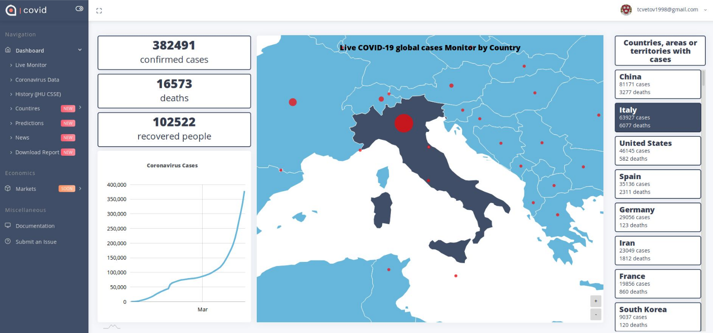
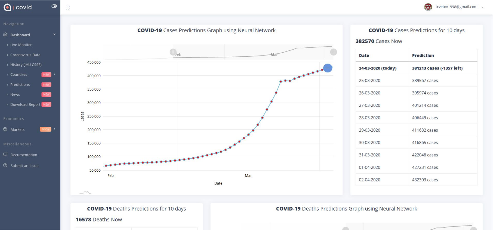

# Coronavirus Prediction Flask Web Application

As a relevant topic in early 2020, it was decided to create a web application on COVID-19 pandemic as a group midterm project on class of "Web Application Development". In order to achieve a maximum grade it was also required to use a Machine Learning model in the project.

## Description and Screenshots

Flask Web Application University Midterm Project, using Flask, Bootstrap, Flask-SQLAlchemy, Pytorch, JavaScript, AmCharts.

Final application allows you to:

- View landing page describing the use of application
- Sign Up, Sign In Authorize via Google
- Monitor Live Data on COVID-19 via source
- Cross-reference data over the world in one table
- Watch historic data and plots
- View information on specific countries
- Parse and display latest news with source links on COVID
- Download a simple PDF report of COVID data



It is also possible to view predictions for COVID cases and deaths on additional page.



You can watch or download project PDF presentation here: [watch presentation](presentation.pdf)

## Deployment

Currently deployed on Heroku: [Coronavirus Flask App](https://coronavirus-prediction-hse.herokuapp.com/) (early version)
Final application is not deployed due to Heroku restrictions on upload size of data.

## Neural Network

To make predictions, Linear model was trained on PyTorch using day-to-day data. Model makes precitions for the next 10 days by default.

- In order to make more complicated, precise and sophisticated models, one can use ARIMA models or Deep Learing models like RNN, GRU, etc.


```
class Net(torch.nn.Module):
    def __init__(self, n_feature, n_hidden, n_output):
        super(Net, self).__init__()
        self.hidden = torch.nn.Linear(n_feature, n_hidden).to(device)
        self.hidden1 = torch.nn.Linear(n_hidden, 800).to(device)
        self.hidden2 = torch.nn.Linear(800, 500).to(device)
        self.hidden3 = torch.nn.Linear(500, n_hidden).to(device)  # hidden layer
        self.predict = torch.nn.Linear(n_hidden, n_output).to(device)   # output layer
```
Before running or deploying web-application, it is neccessary first to train PyTorch Linear model.

Route to train and update weighs on Cases model: `/api/predict/cases`

Route to train and update weighs on Deaths model: `/api/predict/deaths`

Models located in folder: app/models

## Instructions to Setup and Run:

* Clone this repository.
* Use `git clone https://github.com/yaiestura/coronavirus_prediction.git` to clone this repository  to your computer
* Install pip3 on your system by `sudo apt-get install python3-pip` if not already installed.
* Create a virtual environment by the name of **venv** `virtualenv venv`. Information in setting up virtualenv can be found [here](https://docs.python-guide.org/dev/virtualenvs/ "Pipenv & Virtual Environments").
* Activate your virtualenv by `source venv/bin/activate` script
* Execute a `pip3 install -r requirements.txt` command to install the required packages.

## Working:

* Open a terminal and enter `python3 run.py`
* Finally, go to `localhost:5000` to display the start page of application.
* Or you can just run a bash script `sudo bash deploy.sh`

## Future:

Final product is not ideal, and much more was expected to be done or could possibly be done:

- Application lacks smoothness, stability, lacks of tests(e.g unit tests)
- Source of the data: <a>worldometers.info</a> is parsed, so application may crash if HTML structure of original website is modified
- It was expected also to link COVID with Economics data, Market shifts, and to Create another Pytorch model
